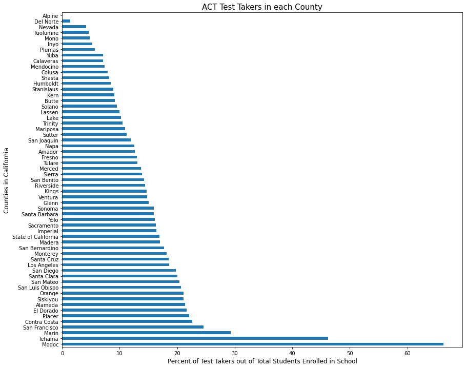
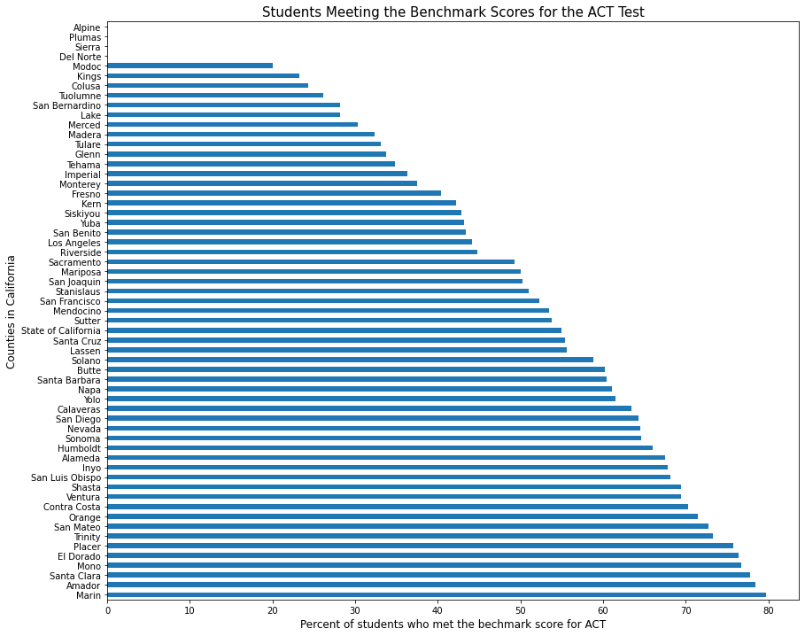
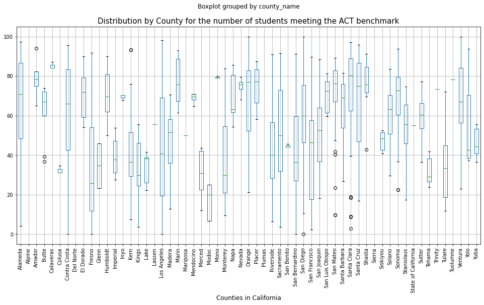
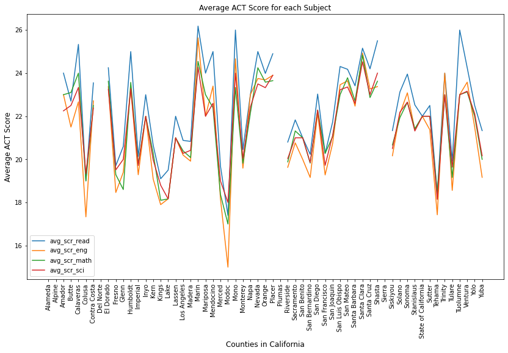
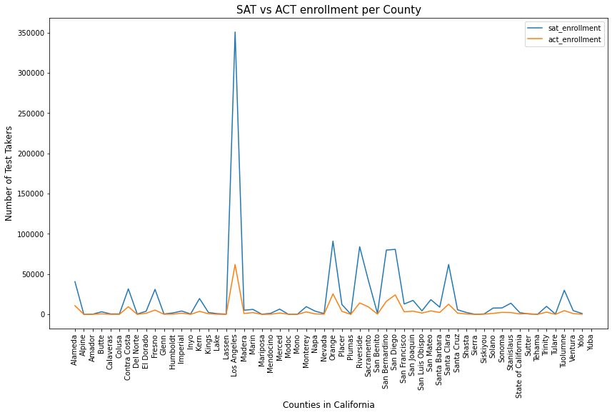

# Standardized Tests Performance in California Schools - Exploratory Analysis

## Table of Contents

* [Background](#background)
* [Problem Statement](#problem-statement)
* [Methodology](#methodology)
    * [Data Collection](#data-collection)
    * [Data Cleaning](#data-cleaning)
    * [Data Engineering](#data-engineering)
* [Data Analysis and Findings](#data-analysis-and-findings)
* [Conclusions](#conclusions)
* [Sources](#sources)

---

## Background
The SAT and ACT are standardized tests that measures a student's aptitude in
areas like verbal, math, science and writing skills. Many colleges and
universities use the student's test scores to assess the readiness for college
and to make admission decisions.

The California Department of Education has published data related to SAT and ACT
performance across schools in the state. This information is useful to analyze
postsecondary preparation and identify trends that can inform the allocation of
resources appropriately.

## Problem Statement
To analyze standardized test performance in California high schools
for 2018-2019. The following questions were explored:
- What are the counties with the lowest and highest SAT and ACT
- Is there a difference between the test scores for English, Math, Science and
Writing?
- How many students in high school signed up to take the SAT and ACT tests?
- Which test, SAT or ACT, do most students sign up for?

---

## Methodology:

## Data Collection

Two datasets were used in this analysis. These included information for SAT and ACT scores for all counties in California. A summary of the data is shown below:

* ACT Data for California 12th graders for 2019
* [`act_2019_ca.csv`](./data/act_2019_ca.csv): 2019 ACT Scores in California by School ([source](https://www.cde.ca.gov/ds/sp/ai/) | [data dictionary](https://www.cde.ca.gov/ds/sp/ai/reclayoutact19.asp))

* SAT Data for California 12th graders for 2019
* [`sat_2019_ca.csv`](./data/sat_2019_ca.csv): 2019 SAT Scores in California by School ([source](https://www.cde.ca.gov/ds/sp/ai/) | [data dictionary](https://www.cde.ca.gov/ds/sp/ai/reclayoutsat19.asp))
* 25 columns and 2576 rows of data

---

## Data Cleaning
* Removed column and rows without information
* Investigated missing values:
    - The missing values in column "SName" were expected because this field belongs to record type "S" for School, and there are 597 records for District and County which will not have an SName. In a similar way, the missing values in column "DName" are expected too because this field belongs to record type "D" for District, and there are 58 records for County which will not have a DName. Below is the breakdown of the record types in the dataset which coincide with the missing values seeing above.
* Changed the data type for columns and identified and fix values within columns that were causing data type discrepancies.
* Changed the names in the columns to make them more explanatory

## Data Engineering
* Created five new columns to combine the information for 11th and 12th graders to evaluate all students together.

---

## Data Analysis and Findings

A data analysis was conducted using Python.

There are 57 counties in this dataset

There are 539 school districts in this dataset

There are 1887 schools in this dataset

The following were the findings from the EDA and Data Visualization:

The number of schools in each county:

The number of students by county who signed up to take the SAT:

The number of test takers by county who met the SAT benchmark score:

The dataset for SAT contains information for students in the 11th grade and 12th grade:

A comparison of test takers in 11th grade vs 12th grade who met the SAT bechmark score:

A comparison of math vs ERW tests test takers who met the SAT benchmark:

The number of students by county who signed up to take the ACT:

The number of test takers by county who met the ACT benchmark score:

The distribution of ACT scores for each county:

A comparison of ACT test subjects by county:

A comparison of number of SAT vs ACT test takers:

## Conclusions
1. Test Takers in the 11th grade scored higher than the students in the 12th grade.
2. For the ACT test, the Reading Test had slightly higher scores than the rest of the tests.
3. More students signed up for the SAT than the ACT.

## Sources:
 * California Department of Education, https://www.cde.ca.gov/ds/sp/ai/whatissat.asp
