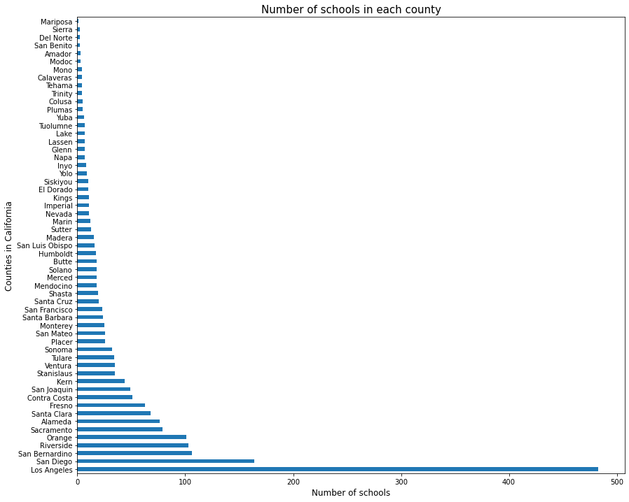
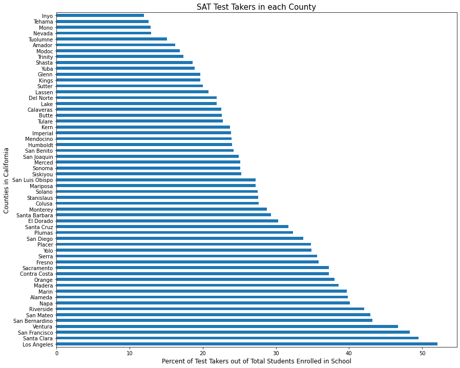
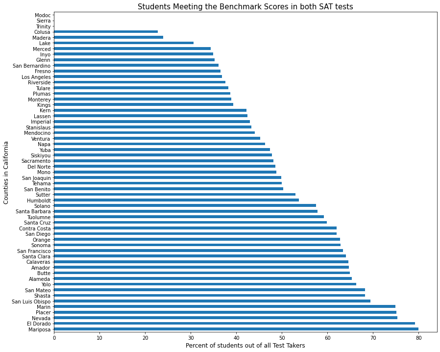
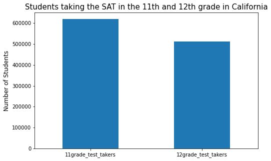
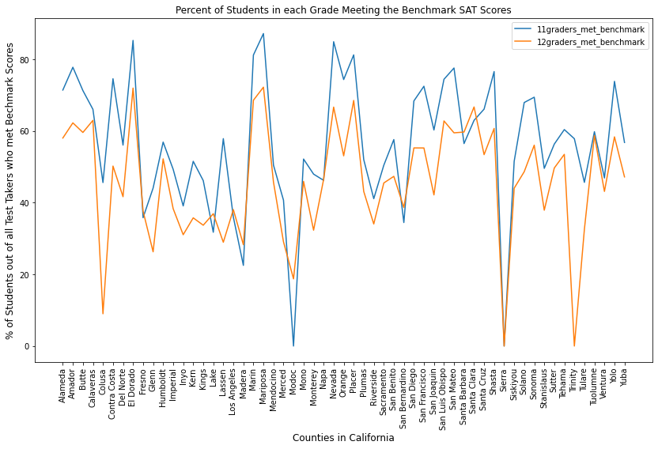
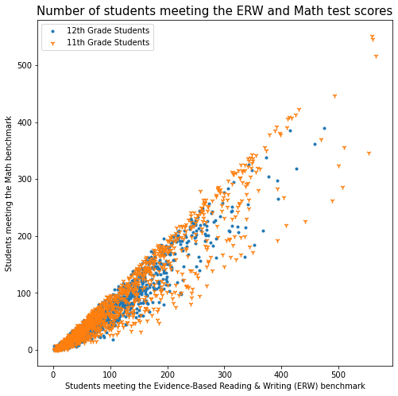
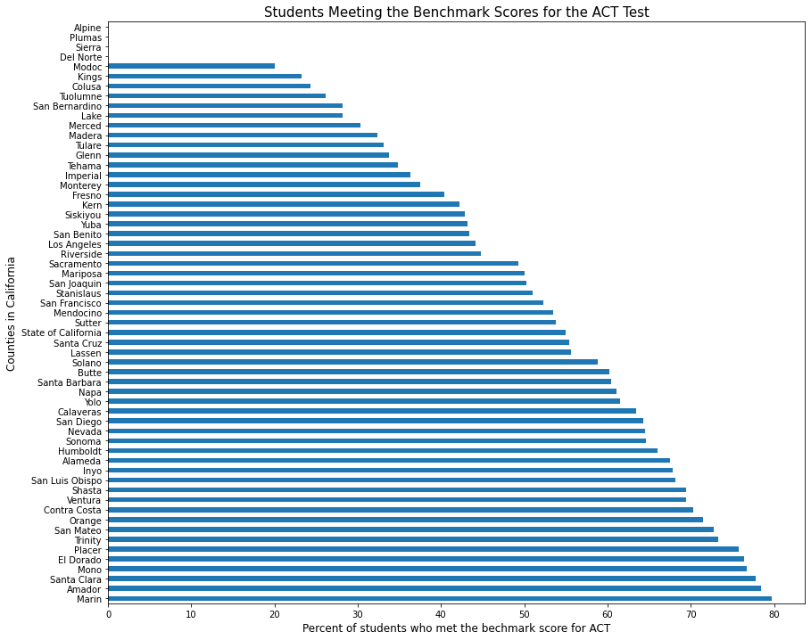
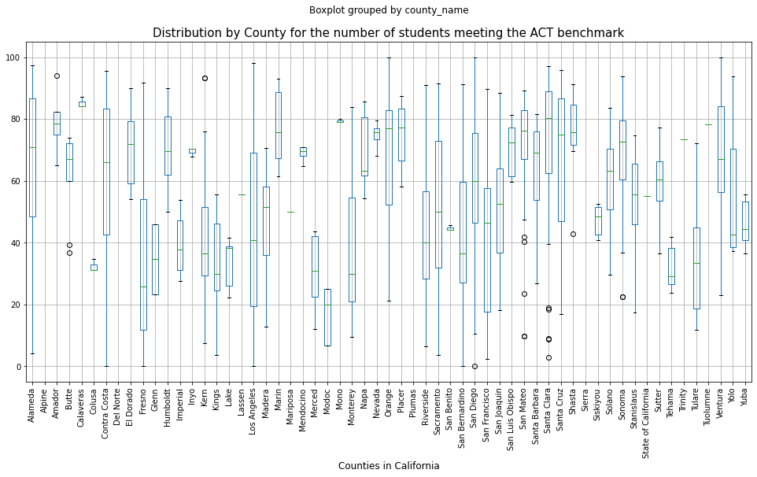
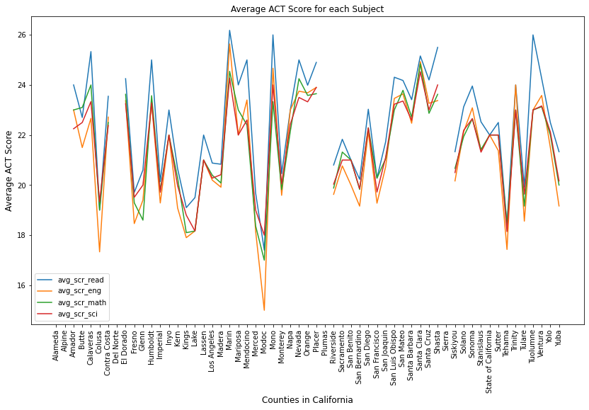
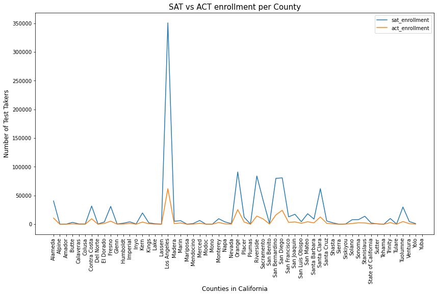

# Standardized Tests Performance in California Schools

## Table of Contents

* [Background](#background)
* [Problem Statement](#problem-statement)
* [Data Collection](#data-collection)
* [Data Cleaning](#data-cleaning)
* [Data Engineering](#data-engineering)
* [Tableau Dashboard](#data-dashboard)
* [Exploratory Data Analysis](#exploratory-data-analysis)
* [Conclusion](#conclusion)
* [Sources](#sources)

---

## Background
The SAT and ACT are standardized tests that measure a student's aptitude in
areas like verbal, math, science and writing skills. Colleges and
universities use these test scores to assess a student's readiness for college as part of their admission process.

The SAT exam is composed of two sections: Math and Evidence-Based Reading, and Writing (ERW). The SAT scores range from 400 to 1600. The college and career readiness benchmark is 480 for Evidence-Based Reading and Writing and 530 for Math.

The ACT is composed of four sections: English, Math, reading and science. The composite score is the average of the four test scores, rounded to the nearest whole number. The composite score and each of the section test scores range from 1 to 36.

The California Department of Education has published data for SAT and ACT
performance for all schools in the state. This information is useful to evaluate
postsecondary preparation and identify trends in school districts which can be used to allocate
resources appropriately.

## Problem Statement
To summarize in a dashboard the results for ACT and SAT by county, school district, and schools in California.
Also, to analyze the data available to answer the following:
- How many schools are in each county?
- What are the counties with the lowest and highest test outcomes for SAT and ACT?
- A comparison of the test scores for English, Math, Science and
Writing?
- A comparison of the student enrollment for SAT vs ACT
- A comparison of the enrollment and performance of 11th vs. 12th graders for the SAT.

---

## Data Collection

The two datasets for SAT and ACT performance were downloaded from the California Department of Education. This information was for the 2018-2019 school year, for 57 counties in California, 539 school districts and 1887 schools. See summary and links for the datasets below.

* ACT Data :[`act_2019_ca.csv`](./data/act_2019_ca.csv): ([source](https://www.cde.ca.gov/ds/sp/ai/) | [data dictionary](https://www.cde.ca.gov/ds/sp/ai/reclayoutact19.asp))
      - Data only for 12th graders
      - Number of students enrolled in 12th grade and number of students taking the ACT test.
      - Average Scores for Math, Science, English and Writing
      - Number of students with a composite score of at least 21.

* SAT Data : [`sat_2019_ca.csv`](./data/sat_2019_ca.csv):  ([source](https://www.cde.ca.gov/ds/sp/ai/) | [data dictionary](https://www.cde.ca.gov/ds/sp/ai/reclayoutsat19.asp))
      - Data for 11th and 12th graders
      - Number of students enrolled in 11th and 12th grade and number of students in those grades taking the SAT test.
      - Number of students who passed the determined benchmark SAT score for ERW, math, and both tests.

---

## Data Cleaning
* Removed column and rows without information in the datasets
* Investigated, resolved, and documented the missing values
* Changed the data type for columns and identified and fix values within columns that were causing data type discrepancies.
* Changed the names in the columns to make them more explanatory and easier for analysis

## Data Engineering

* For the SAT dataset:
   - Created five new columns to combine the information for 11th and 12th graders to evaluate the SAT data for all students together.
   - In Tableau, created calculated fields to plot the percent of students who signed up to take this test, and the percent of passing scores.

* For the ACT dataset:
   - In Tableau, created calculated fields to store the  composite score (overall ACT score), and the percent of students who took the ACT in 12th grade by county.

---
## Tableau Dashboard  

An interactive dashboard was created in Tableau to summarize both ACT and SAT data by county, school district and school.

ACT Dashboard:
Explore this complete Tableau dashboard [here](https://public.tableau.com/views/StandardizedTestPerformanceCA/ACTPerformance?:language=en&:display_count=y&publish=yes&:origin=viz_share_link)

<noscript></noscript><object class='tableauViz'  style='display:none;'><param name='host_url' value='https%3A%2F%2Fpublic.tableau.com%2F' /> <param name='embed_code_version' value='3' /> <param name='site_root' value='' /><param name='name' value='StandardizedTestPerformanceCA&#47;ACTPerformance' /><param name='tabs' value='no' /><param name='toolbar' value='yes' /><param name='static_image' value='https:&#47;&#47;public.tableau.com&#47;static&#47;images&#47;St&#47;StandardizedTestPerformanceCA&#47;ACTPerformance&#47;1.png' /> <param name='animate_transition' value='yes' /><param name='display_static_image' value='yes' /><param name='display_spinner' value='yes' /><param name='display_overlay' value='yes' /><param name='display_count' value='yes' /><param name='language' value='en' /><param name='filter' value='publish=yes' /></object>
                

--

SAT Dashboard:
Explore this complete Tableau dashboard [here](https://public.tableau.com/views/SATPerformanceCASchools/SATPerformance?:language=en&:display_count=y&publish=yes&:origin=viz_share_link)

  <iframe src="https://public.tableau.com/views/SATPerformanceCASchools/SATPerformance?:embed=yes&:display_count=yes"></iframe>

        

---

## Exploratory Data Analysis

Using Python's Pandas, and Plotly libraries, the data for SAT and ACT was analyzed to evaluate the following questions:

**How many schools are in each county in California?**

California is the second state with the most school districts in the United States. However, not all counties in California have the same amount of school districts. There are many large rural areas with few schools, and small urban areas with many schools. Figure 1 below shows the number of schools in each county. This information is useful to understand the student population in each county and the resources they may need.

| |
|:--:|
| Figure 1. Number of Schools in each CA county |

**The percent of 11th and 12th graders who signed to take the SAT**

Participation in the SAT is good indicator of students plan after school. Figure 2 below shows for the students in the last two grades of high school, how many were interested in taking the SAT.

|  |
|:--:|
| Figure 2. Number of Test Takers in each CA county |

**The percent of test takers who met the SAT benchmark score**

Performance in the SAT tests is a good indicator of how well prepared are students for college. Figure 3 shows a proportion of the test takers who met the benchmark score in the SAT.  

|  |
|:--:|
| Figure 3. Percent of Test Takers meeting SAT benchmark |

**The enrollment of 11th vs. 12th graders for the SAT**

Figure 4 below shows that for all counties, more 11th graders signed up to take the SAT exam.

|  |
|:--:|
| Figure 4. Total Number of 11th vs 12 graders enrolled in the SAT |

**The performance of 11th vs. 12th grades who passed the SAT benchmark scores**

Figure 5 below shows that more 11th graders passed the benchmark SAT score than 12th graders in most counties.

|  |
|:--:|
| Figure 5. Percent of 11th vs 12th graders meeting SAT benchmark per county|

**Performance for ERW and Math tests**

Figure 6 below shows a scatterplot of the number of students in 11th and 12th grade passing the SAT benchmark scores in ERW and Math. The figure shows a positive linear relationship which means that the students who passed one test, also passed the other one. However, it looks like for some schools, more students met the ERW benchmark than the Math benchmark.  

|  |
|:--:|
| Figure 6. Number of Test Takers meeting the benchmark for ERW vs Math |

**Performance outcomes for the ACT exam**

Figure 7 shows the percent of students who had a composite score of at least 21. The average of the four ACT tests is 21.

|  |
|:--:|
| Figure 7. Percent of Students by County getting a composite ACT score of at least 21 |

**The distribution of ACT scores for each county**

Figure 8 below shows the distribution of the ACT performance for all counties.

|  |
|:--:|
| Figure 8. Distribution of ACT Performance by County |

**A comparison of ACT scores for Reading, English, Math, and Science**

Figure 9 below shows that students scored higher in the Reading test than Math, Science and English across most counties.

|  |
|:--:|
| Figure 9. Average ACT scores for each subject by county |

**Enrollment of SAT vs. ACT exams**

Figure 10 below shows that the SAT is more popular among students. For the school year of 2018-2019, more students in California enrolled in the SAT than in the ACT.

|  |
|:--:|
| Figure 10. Number of Test Takers for the SAT vs. ACT for each CA county |

## Conclusion
1. For the SAT, data was available for 11th and 12th graders. The data shows that more 11th graders signed up to take the SAT than 12th graders, and they performed better too as seen on the number of students meeting the benchmark scores.
2. For the ACT, the average score for the Reading test is higher than the average scores for math, science and English in most counties.
3. In general for all counties, more students signed up to take the SAT than the ACT exam.

## Sources:
 * California Department of Education, [source](https://www.cde.ca.gov/ds/sp/ai/whatissat.asp)
 * SAT Results, [source](https://reports.collegeboard.org/archive/sat-suite-program-results/2018/class-2018-results#:~:text=The%20college%20and%20career%20readiness,%2D%20and%20four%2Dyear%20colleges)
